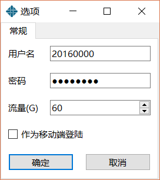

# NEU-Monitor
## 使用教程
* 注：软件只有托盘中的图标以及单击显示的菜单，并没有主窗口
1. 在设置中填好校园网账号，密码以及流量（剩余流量过少时发出提醒）

2. 开始使用

3. 双击托盘图标可以登录

   

   
## 自动登陆
1. 在已经登陆的状态下检测到校园网状态变为断开，此时会进行重新登陆，重新登陆等同于在ipgw网页点击`断开连接`后再进行`连接网络`
2. 首次启动应用时进行登陆
3. 手动断开网络的情况下不会自动重新登陆

## 勿扰模式

该模式下不会发出系统通知

## 网络状态检测
网络状态分为
* 未连接到校园网
* 连接到校园网并已经登陆
* 连接到校园网但未登陆

*为了检测网络状态，此工具会持续发送请求，~~可能由于请求频率过高，有很大概率会出现网关登陆被限制的情况（提示请5分钟之后再尝试）~~

*请不要短时间内频繁的进行登陆，否则会出现登陆受限的情况